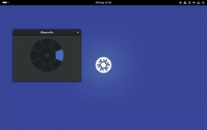
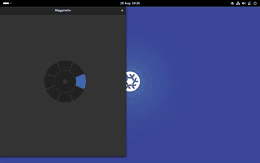
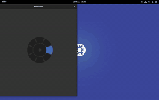
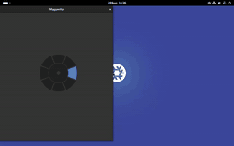
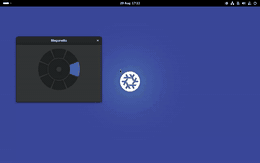

<p align="center">
  
</p>

# Magunetto

Radial window snapping for GNOME Shell. Hold a shortcut, flick the pointer toward a direction, and
release: the focused window snaps to that region of the screen.

Inspired by [Loop](https://github.com/MrKai77/Loop) on macOS.

## How it works


Hold **Alt** and tap **Z**. A radial menu appears where the pointer is. Keep Alt held and move the
mouse:

```
                  top
        top-left    |    top-right
                \   |   /
                 \  |  /
      left -------[ o ]------- right      o = centre: fill the work area
                 /  |  \                      inside it: no selection
                /   |   \
     bottom-left    |    bottom-right
                 bottom
```

Direction picks the sector, distance picks the band: near the centre nothing is selected, a little
further selects the centre action, further still selects a direction. Release Alt to snap, Escape to
cancel.

As you move, the region you would get is outlined on screen. Nothing is outlined while you are in
the dead zone, because releasing there would leave the window where it is — so the outline is also
the answer to whether you have selected anything at all.

Selection follows the direction you moved, not where the pointer landed, so you can flick past the
menu and still hit the sector you aimed at.

The window travels to its region rather than appearing there. The outline, the travel, and the style
of the travel can each be changed — see [Snapping](#snapping) below.

## Requirements

GNOME Shell **50**, on Wayland. Later GNOME releases are supported on their own branches and tags.

## Install

Download `magunetto@matteopacini.me.shell-extension.zip` from the
[latest release](https://github.com/matteo-pacini/Magunetto/releases/latest):

```sh
gnome-extensions install --force magunetto@matteopacini.me.shell-extension.zip
```

Log out and back in, then:

```sh
gnome-extensions enable magunetto@matteopacini.me
```

### Nix

Add the flake input:

```nix
{
  inputs.magunetto.url = "github:matteo-pacini/Magunetto";
}
```

Then install the package on NixOS:

```nix
{
  environment.systemPackages = [ inputs.magunetto.packages.${pkgs.system}.default ];
  programs.dconf.enable = true;
}
```

### Home Manager

Install the package and enable it declaratively, so the extension and its shortcut are part of your
configuration:

```nix
{
  home.packages = [ inputs.magunetto.packages.${pkgs.system}.default ];

  dconf.settings = {
    "org/gnome/shell" = {
      enabled-extensions = [ "magunetto@matteopacini.me" ];
    };

    "org/gnome/shell/extensions/magunetto" = {
      show-radial-menu = [ "<Alt>z" ];
      snap-preview = true;
      snap-animation = true;      snap-animation-curve = "quint";
      snap-outer-gap = 8;
      snap-inner-gap = 12;
    };
  };
}
```

Log out and back in after the first activation: the shell only scans for new extensions at startup.

## Changing the shortcut

Run `gnome-extensions prefs magunetto@matteopacini.me` and click the shortcut row, or set
`show-radial-menu` as shown above.

Two constraints:

- The shortcut needs at least one modifier. Releasing that modifier is what applies the selection;
  without one, the menu can only close on a timeout.
- Super cannot be used. Holding it puts the shell into overview mode, where the shortcut stops
  matching.

`<Alt>space` is bound to GNOME's window menu and does nothing until that binding is cleared.

## Snapping

Run `gnome-extensions prefs magunetto@matteopacini.me`. Three settings govern what you see of a
snap, and two govern where the window ends up.

**Preview** (`snap-preview`, on by default) — whether the region is outlined while the menu is up.
Unlike the two below, this is not suppressed when the desktop is set not to animate: the outline
still appears, it just stops sliding into place. Where a window will land is information rather than
decoration.

**Animate** (`snap-animation`, on by default) — whether the window is seen to travel, or simply
appears in its region.

**Style** (`snap-animation-curve`, `quint` by default) — how it travels. Each is described in the
preferences as you select it, and shown below.

| | | |
|:--:|:--:|:--:|
|  |  |  |
| **Instant** · `expo`<br>Almost immediate, then a long drift into place. | **Snappy** · `quint` — the default<br>Most of the move happens at once, then it settles. | **Settle** · `md`<br>Quick to move, unhurried to stop. |
|  |  |  |
| **Soft** · `cubic`<br>Sharper than GNOME's own, still gentle at the end. | **Standard** · `quad`<br>The curve GNOME uses for its own window animations. | **Spring** · `spring`<br>Overshoots as it slides, but never grows past its region. |
|  | | |
| **Overshoot** · `back`<br>Slides past the target and comes back, briefly exceeding its region. | | |

Those clips are slowed to a third of real speed, all by the same amount. A travel lasts 220ms — at
that speed the seven are indistinguishable, and the point of the grid is the shape of each rather
than how long it takes.

**Outer gap** (`snap-outer-gap`, 0 by default) — space, in pixels, between a snapped window and
the edge of the work area, on all four sides.

**Inner gap** (`snap-inner-gap`, 0 by default) — the total space between two windows snapped to
neighbouring regions: two halves side by side are exactly this far apart. Filling the work area
with the centre action ignores it and keeps the outer gap alone.

Both range from 0 to 100, and both show in the preview: the region you see outlined is the region
you get.
The duration is fixed. A style and a duration are not independent — a sharp style needs longer than
a soft one to read the same way — so only the style is offered.

The travel is immediate whatever Animate and Style say if the desktop itself is set not to animate
(`org.gnome.desktop.interface enable-animations`). The outline is not affected, as above.

## Translations

The preferences read in twelve languages besides English:

`de` German · `es` Spanish · `fr` French · `it` Italian · `ja` Japanese · `nl` Dutch · `pl` Polish ·
`pt_BR` Brazilian Portuguese · `ru` Russian · `tr` Turkish · `uk` Ukrainian · `zh_CN` Simplified
Chinese — and `en_US`, which is British English with American spelling.

Strings are written in British English, so that is what a session in any other language reads. The
radial menu has no text in any language: it says what is selected by shape and position, which is
also why it can be read at a glance mid-gesture.

To add a language or correct a word, see [po/TRANSLATING.md](po/TRANSLATING.md) — it lists every
string with where it appears on screen, and `po/update.sh` does the rest. Corrections are
particularly welcome: the catalogues were not all written by native speakers.

## Development

```sh
nix develop

tests/run-all.sh         # unit tests and the headless harness
tests/run-all.sh --vm    # adds the NixOS virtual-machine test

node --test tests/*.test.js                # gesture maths and travel styles, no shell
dbus-run-session -- tests/harness/run.sh   # harness only
dbus-run-session -- tests/harness/run.sh gesture cancel   # named cases

tests/harness/watch.sh   # nested shell in a window, to drive the menu by hand
```

The nested shell binds **Alt+X**, not Alt+Z: whatever the compositor outside matches is consumed
before it reaches the nested window, so a copy installed on the desktop would swallow the shortcut.

The harness boots a headless GNOME Shell with a virtual monitor, loads the extension, and asserts on
its state trace and the resulting window geometry. Screenshots and logs from failing cases land in
`.harness/`.

The gesture has to be driven from inside the compositor — it needs a modifier held down while the
pointer moves, which nothing outside can do on Wayland. So the harness asks the shell to import
`harness/shellhook.js`, which synthesises the input. That file is part of the tests, not of the
extension: nothing capable of injecting input is ever shipped.

Sessions run under a throwaway home with `GSETTINGS_BACKEND=keyfile`, which keeps every setting
written during a test inside that directory.

The demo at the top of this file is recorded from the same harness, so it always shows the code as
it stands:

```sh
dbus-run-session -- tests/harness/run.sh _demo   # records .harness/demo.webm
tests/harness/demo-encode.sh                     # writes assets/demo.{gif,mp4}

dbus-run-session -- tests/harness/run.sh _curves # records .harness/curve-*.webm
tests/harness/curves-encode.sh                   # writes assets/curves/*.gif
```

The travel-style grid above comes from the same place: one clip per style, the same gesture each
time, recorded at 60fps because a 220ms travel is seven frames at 30 and that cannot show the
difference between an ease that is nearly over by its midpoint and one that overshoots.

### Layout

```
magunetto@matteopacini.me/
  extension.js           keybinding, gesture lifecycle, state log
  prefs.js               shortcut, and the snapping settings
  stylesheet.css         menu colours
  schemas/               GSettings schema and its defaults
  lib/geometry.js        sector and rectangle maths, no imports
  lib/curveInfo.js       the travel styles and their descriptions, no imports
  lib/curves.js          turning a style into Clutter easing
  lib/animate.js         freeze, snapshot, transform, ease
  lib/radialMenu.js      modal grab, release detection, drawing
  lib/snap.js            target eligibility and applying geometry
po/                      compiled into the extension's locale/ at build time
  magunetto.pot          the template, extracted from the sources
  *.po                   one catalogue per language
  LINGUAS, POTFILES      which languages ship, and which files are read
  update.sh              re-extract, and merge into every catalogue
  TRANSLATING.md         where each string appears, and the rules
tests/
  geometry.test.js       unit tests for the maths
  curveInfo.test.js      unit tests for the travel styles
  l10n.test.js           the catalogues, and what a translation must keep
  locale-check.js        asserts a catalogue resolves from an installed tree
  run-all.sh             every tier in one command
  nixos-test.nix         virtual-machine test
  harness/run.sh         boots headless sessions, runs the cases
  harness/lib.sh         assertions, gesture and recording helpers
  harness/cases/         one file per behaviour under test
  harness/testwindow.js  a window with predictable size constraints
  harness/shellhook.js   control surface, injected into the shell under test
  harness/watch.sh       nested shell for driving the menu by hand
  harness/demo-encode.sh turns a recorded demo into the README's assets
  harness/curves-encode.sh  turns the travel-style recordings into the grid above
package.nix              the extension derivation
flake.nix                devShell, package, and the vm check
```

## Contributing

Contributions are welcome — issues, bug reports, and pull requests alike.

Behaviour changes are spec-driven. The contract lives in `openspec/specs/`, and a change starts
there rather than in the code: propose it with OpenSpec, write the requirements and scenarios, then
implement. Each scenario should end up with a matching case in `tests/harness/cases/` — except
translations, which the harness cannot see at all, and which `tests/l10n.test.js` covers instead.

A translation needs none of that. Edit or add a file under `po/`, run `po/update.sh`, and open a
pull request; [po/TRANSLATING.md](po/TRANSLATING.md) has everything else.

Run `tests/run-all.sh` before opening a pull request, and include the result. Every tier must pass.

### AI-assisted contributions

Accepted, on the same terms as any other contribution:

- Follow [AGENTS.md](AGENTS.md) (symlinked as `CLAUDE.md`). It carries the project's constraints and
  the traps that are easy to fall into.
- Keep the spec-driven flow: specs before implementation.
- Run the tests and confirm they pass. Do not submit work that has not been run.

You are responsible for what you submit, whether or not a model wrote it.

## Licence

GPL-3.0-or-later. See [LICENSE](LICENSE).
